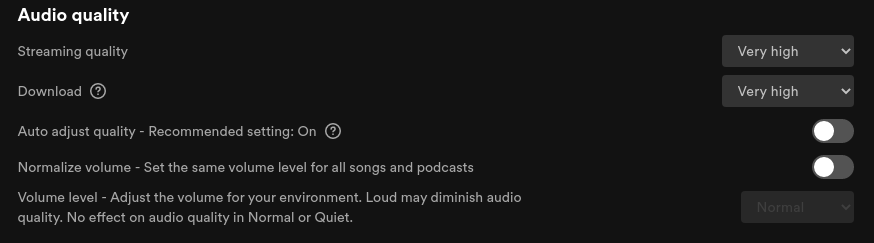

# Spotify-recorder

Spotify-recorder is, as it name suggest a Spotify recorder for Linux.
Given a song name, or its share link, starts Spotify, plays and records the song at its best quality, then exits. As simple as that !

Works on both Pulseaudio and Pipewire. Please note that a Spotify client is required 

Songs recorded at 320kbps bitrate by default.

FYI, Spotify has a much higher quality than its YouTube equivalent, so I highly recommend it when possible. Check the *Why record from Spotify instead of downloading the song from YouTube ?* section for more information.

> This tool is (for now) Linux exclusive. As long as the dependencies are met, it should work fine.

> This tool is in beta stage. Please don't mind if you you encounter a problem, and feel free to open an Issue for any suggestion or bug !

## Features :
- Record a song given a title name
- Record a song given a share link
- Record a playlist given a share link

Features to be added in future :
- [x] Finalize recording all tracks within a playlist
- [x] Migrate to argparse
- [x] Skip recording if song already has been recorded
- [x] Add metadata (ID3 tagging)
- [ ] Add option to start spotify headlessly
- [ ] Make API only a feature, remove it's default necessity
- [ ] Summary of songs recorded within a playlist
- [ ] Add bitrate and file extension choice support.
- [ ] Option for 160/320kbps
- [ ] Record a song based on user's likes.
- [ ] Record the current played song.
- [ ] Record multiple songs, and split them.
- [x] Add support for pipewire
- [ ] Filter tracks by user's market availability
- [x] Add support for albums
- [ ] Record music without output (dry-run)

## Dependencies :
`Python 3+` with `python-dotenv`, `spotipy` and `mutagen` modules.

packages : `mp3splt, ffmpeg, pulseaudio-utils or pipewire-pulse`

core-utils : `grep, tr`

## Installation : 
`git clone https://github.com/fm16191/spotify-recorder.git`

`cd spotify-recorder`

`pip install -r requirements.txt`

- Ubuntu:
   `sudo apt install mp3splt ffmpeg`

- Arch :
   `sudo pacman -S ffmpeg mp3splt`

## Set up :

Get your Spotify API credentials
1. Go to [Spotify's developper page](https://developer.spotify.com/dashboard/applications) and create an application.

2. Go to "Edit Settings" 
 - In the "Website" input, put `http://localhost:8888`
 - In the "Redirect URIs" input, put `http://localhost:8888/callback`

3. Edit the .env file and replace `YOUR_CLIENT_ID` and `YOUR_CLIENT_SECRET` by your respectives CLIENT_ID and CLIENT_SECRET from the Spotify app just created

## Usage :
`python3 api.py <song name author>` to search and record a song given an input

`python3 api.py https://open.spotify.com/track/X` to record a song from it's share link

`python3 api.py https://open.spotify.com/playlist/X` to record all songs from a playlist's share link

Unless given the share link, this will lookup for the query, and if multiple results, ask for one.

Once song identified, Spotify will start, play the song while being recorded, and then quit.

## Recommended Spotify setup

Disable all music fading (improve song trimming)

Improve audio quality

## Recommended pulseaudio setup
- Edit the `/etc/pulse/pulse.pa` file
  - Look for the `load-module module-udev-detect` line and comment it.
  - Add the `load-module module-udev-detect tsched=0` line below

   This would greatly improve the sink latency for recording

- Edit the `/etc/pulse/daemon.conf` file
  - Add `avoid-resampling = true`
   - If you still getting audio crackling, you can overwrite the defaults for `default-fragments = 2` and `default-fragment-size-msec = 10`

## Known issues : 

> Please first refer to the "Recommended Spotify setup" and "Recommended pulseaudio setup" tabs.

- Due to Pulseaudio sink latency, after a while, audio might start to overwrite itself, resulting in an awful output.
   **Solution** : restart Spotify

## *Why record from Spotify instead of downloading the song from YouTube ?*

1. Spotify has much better sound quality than YouTube, and the recording hardly affects the quality from what I tested, as long as you follow the "Recommended configuration for Spotify" section.

   For your information, YouTube's audio quality is capped at 128kbps, while Spotify's audio quality defaults to 160kbps, up to 320kbps for premium accounts. 

   In addition, YouTube normalizes the audio to further reduce storage, as soon as it is uploaded, an option that can be disabled on Spotify

   (But how much is it a difference ? *Unless you don't care much about audio quality, the difference is pretty noticeable. I'll post some experiments I've done to illustrate the difference sometime.*)
2. Some music has an intro on YouTube, which would require post processing to remove it, which is not the case on Spotify
3. Sometimes the music you're looking for is just not available on YouTube :)
